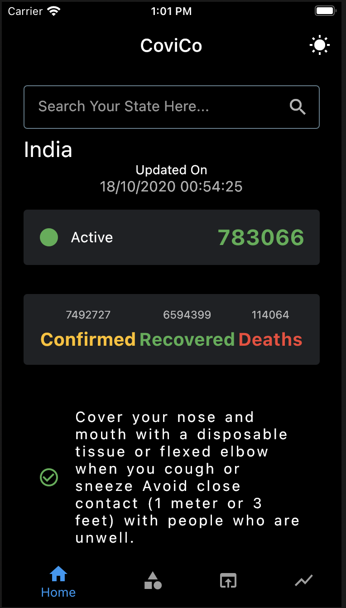
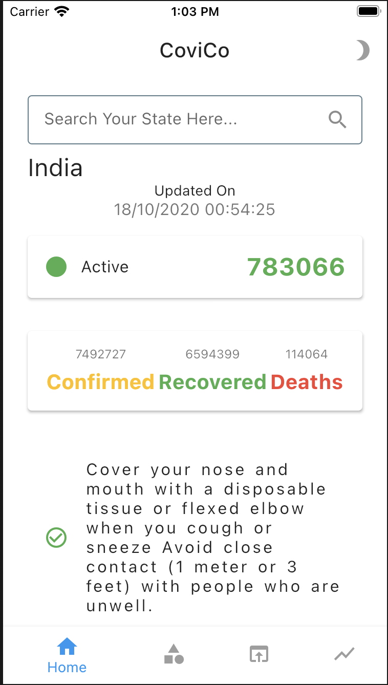
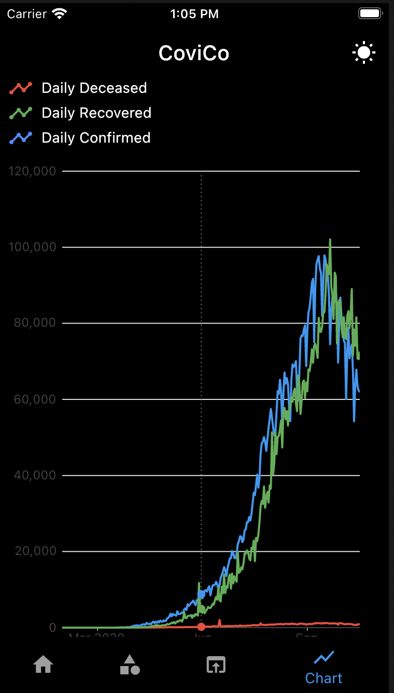
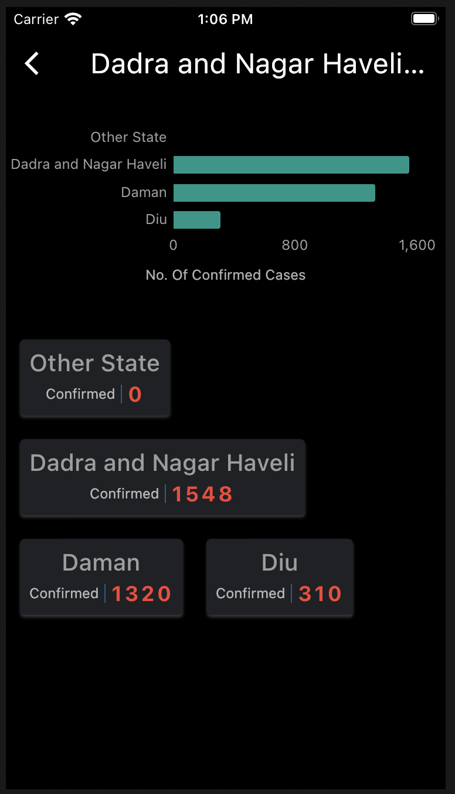
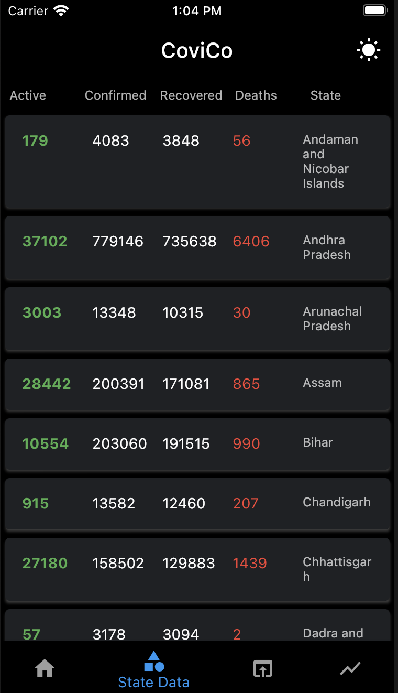

## CoviCo
CoviCo keeps the track of number of affected people in India due to Corona virus.

## Motivation
Coronavirus disease (COVID-19) is an infectious disease caused by a new virus. WHO declared it as a pandemic disease.
As a computer science engineer i just come up with this idea to build an app which can update its users about this pandemic in India.

## Results

   

    

## Tech/framework used
1. Dart
2. Flutter
3. Bloc architecture
4. Dependency Injection
5. RxDart
6. Charts
7. Provider
8. Dio
9. Sembast

<b>Built with</b>
- [IntliJ](https://www.jetbrains.com/idea/)

## Features
1. Search
2. Tabular Representation of Confirmed, Active, Deaths, Recovered number of people everyday.
3. Graphical representation of confirmed cases in a particular district.
4. Comparision using charts b/w number of daily confirmed, daily recovered, daily deaths.
5. Themes

## API Reference
https://api.covid19india.org/data.json

Above api is used to get the latest data.

