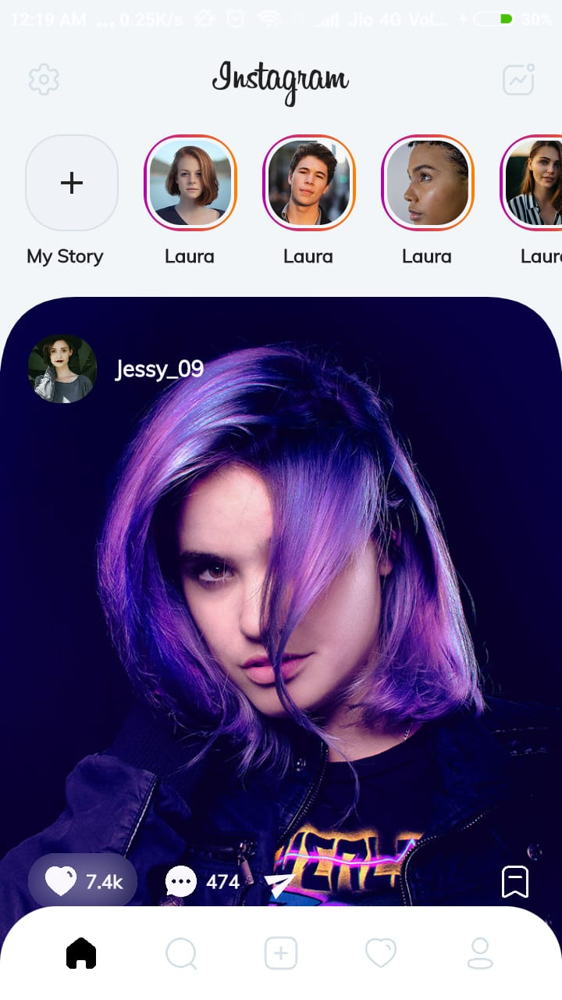
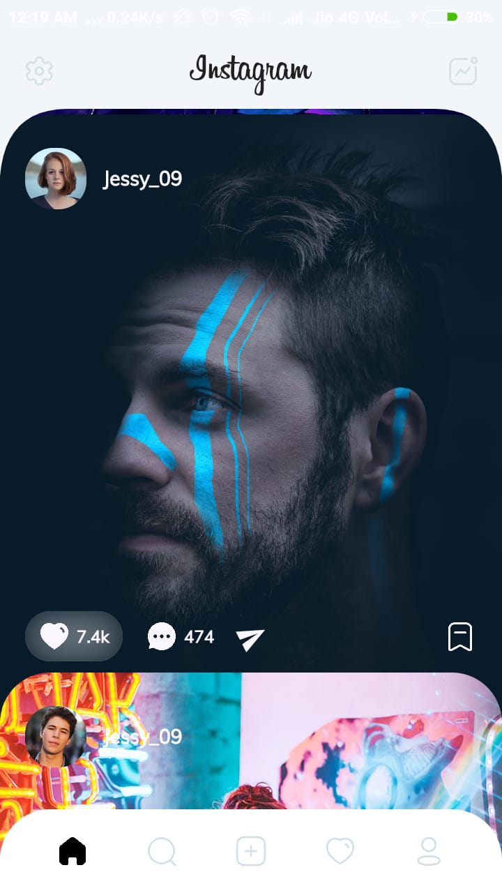
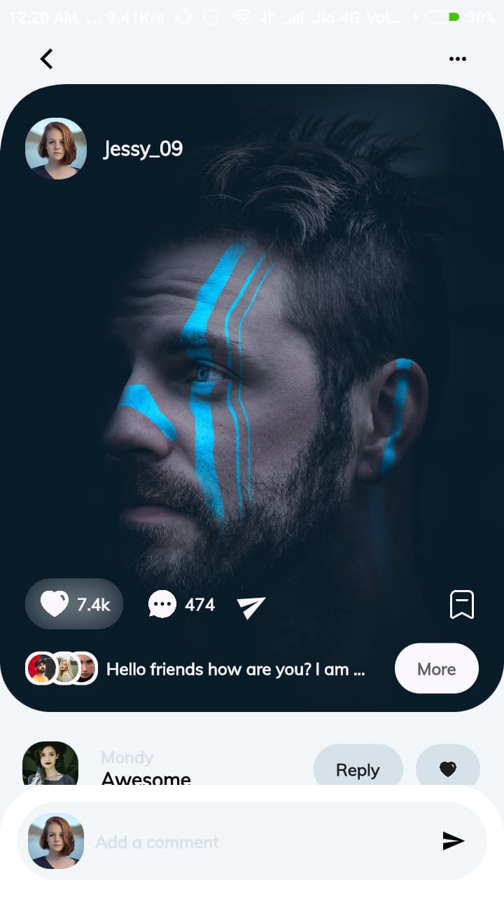
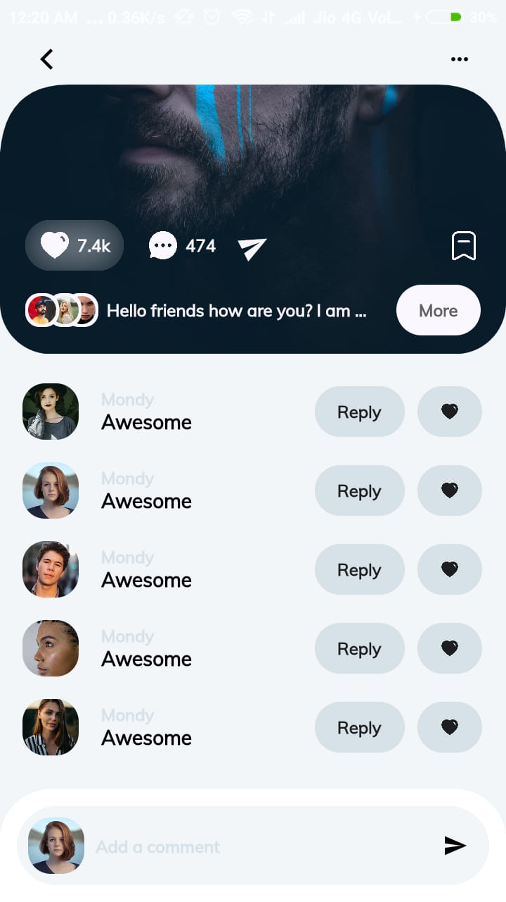

# Instagram Redesigned Flutter App

A Redesigned Instagram UI using Flutter.  
[Check the video recording of the app here](https://www.instagram.com/p/CFpJmgyDcu3)

## Design Inspiration

All design credit goes to [Manuel Rovira](https://dribbble.com/ManuelRovira) 
for making this lovely [design.](https://dribbble.com/shots/14057207-Instagram-Redesign-Part-2)

## Results

   

## Support

  
[Instagram](https://www.instagram.com/ava.amitverma/)  
[LinkedIn](https://www.linkedin.com/in/amit-verma-962b12197/)

> If you found this project helpful or you learned something from the source code and want to thank me, consider buying me a cup of :coffee:
>
> * UPI ID - av.amit2040fw@okaxis
