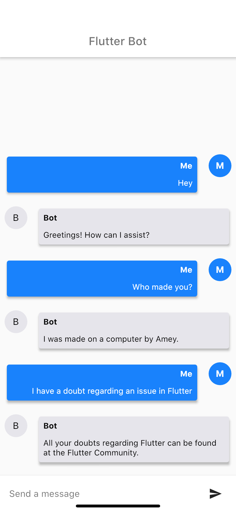
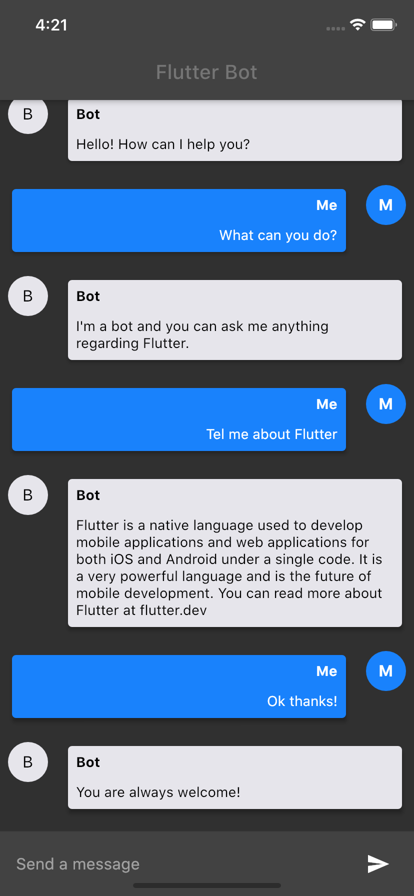

# chatbot

Chatbot using Flutter and DialogFlow

## Getting Started

This project is a starting point for a Flutter application.

A few resources to get you started if this is your first Flutter project:

- [Lab: Write your first Flutter app](https://flutter.dev/docs/get-started/codelab)
- [Cookbook: Useful Flutter samples](https://flutter.dev/docs/cookbook)

For help getting started with Flutter, view our
[online documentation](https://flutter.dev/docs), which offers tutorials,
samples, guidance on mobile development, and a full API reference.

## Google Cloud Platform API

Choose your project from GCP and then generate credentials from the APIs & Services dashboard.
Create a service account or if you have one, then open up the link from the Service Accounts section at the bottom.
Then add a key and choose the JSON file, which automatically downloads to your system.
Rename it to credentials and add it in the assets file.

## Note

If you do not retrieve the API from GCP then following will throw up a null value error: 

```
AIResponse response = await dialogflow.detectIntent(query);
```
## Screenshots

    
